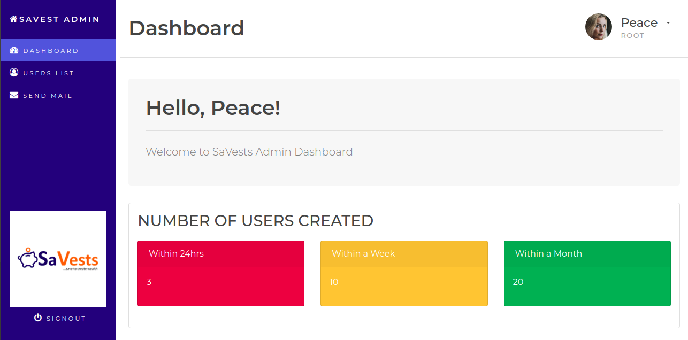

# SAVESTS ADMIN

A customized Admin dashboard - SaVests Interview Project

## Table of Contents

- [Example](#example)
- [Prerequisites](#prerequisites)
- [Installation](#installation)
- [Features](#features)
- [Deployment](#deployment)
- [License](#license)

## Example

- Screenshot


- Code Example

```python
@login_required
def email_users(request):
    sent = False
    users_email = list(User.objects.values_list('email', flat=True))

    if request.method == 'POST':
        # Form was submitted
        form = EmailPostForm(request.POST)
        if form.is_valid():
            # Form fields passed validation
            cd = form.cleaned_data
            sender = request.user.email
            subject = "Message from Admin"
            message = cd['message']
            send_mail(subject, message, sender, users_email)
            sent = True
    else:
        form = EmailPostForm()

    return render(request,
                  'myadmin/email_users.html',
                  {'section': 'email',
                   'form': form,
                   'sent': sent,
                   })
```

### Getting Started

These instructions will get you a copy of the project up and running on your local machine for development and testing purposes. See [deployment](#deployment) for notes on how to deploy the project on a live system.

## Prerequisites

What you need to setup the project

- Python 3
- Pip install packages
- pipenv

## Installation

__To get a development environment running:__

> clone this repo to your local machine

```
git clone https://github.com/JohnJohnsonOkah/savests_admin.git
```

> Install Requirements

```shell
$ pipenv install
```

> Activate virtual environment
```shell
$ pipenv shell
```

> Setup Database and Create Superuser

```
not required! db.sqlite3 available..
```

> Run Development Server

```shell
$ python manage.py runserver
```

... 👯 Now development server is up and running...

## Features

- Light-weight admin dashboard page
- Dashboard displays user metrics
- Login to django-admin is redirected to custom admin
- Allow staff set a user to active or inactive (via button click)
- Allow staff send email to all existing users (console.EmailBackend)

## Deployment

Additional notes about how to deploy this on a live system
- Not yet available

## License

[MIT](LICENSE)